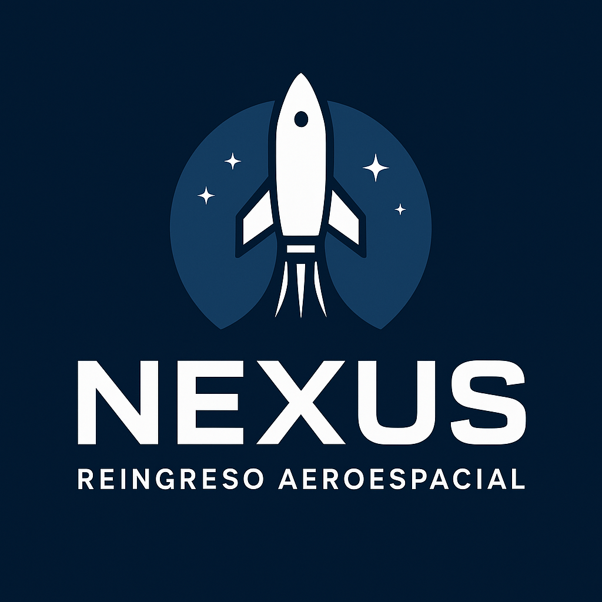

<!-- Fondo general -->

<!-- Logo centrado -->

  

<h1 align="center" style="font-size:32px; margin-top:10px;">PROYECTO FINAL</h1>

  Simulación tipo arcade donde se controla un cohete qué debe completar misiones a través de los planetas del sistema solar.

<!-- Objetivo -->
<h2 style="font-size:26px;">🚀 OBJETIVO:</h2>

El cohete debe descender y aterrizar en distintos planetas del sistema solar, 
evitando meteoritos, administrando combustible hasta lograr reingresos seguros.

<!-- Descripción -->
<h2 style="font-size:26px;">🛰️ DESCRIPCIÓN DEL PROYECTO:</h2>

<b>NEXUS</b> es un videojuego desarrollado en <b>Python + Pygame</b>. Consiste en completar misiones atravesando los planetas del sistema solar, tratando de controlar la nave en descenso.

<!-- Características -->
<h2 style="font-size:26px;">✨ CARACTERÍSTICAS PRINCIPALES:</h2>
<ul style="font-size:18px;">
  <li> Movimiento del cohete con física simple.</li>
  <li> Sistema de combustible.</li>
  <li> Meteoritos y estrellas recolectables.</li>
  <li> 8 planetas con texturas y animaciones.</li>
  <li> Pantallas de pausa, nivel completado y game over.</li>
  <li> Sistema de partículas (propulsión, explosiones).</li>
  <li> Nebulosas animadas.</li>
  <li> HUD con puntaje, vidas y combustible.</li>
  <li> Optimización con caché de superficies.</li>
</ul>

<!-- Estructura -->
<h2 style="font-size:26px;">📂 ESTRUCTURA DEL PROYECTO:</h2>

<ul style="font-size:18px;">
  <li><b>nexus.py</b> — Código principal: físicas, controles, colisiones y renderizado.</li>
  <li><b>logo.png</b> — Logo usado en el menú principal y en este README.</li>
  <li><b>requirements.txt</b> — Dependencias del proyecto.</li>
  <li><b>README.md</b> — Documentación del proyecto.</li>
</ul>

<!-- ¿CÓMO EJECUTAR EL JUEGO? -->
<h2 style="font-size:26px;">🕹️ ¿CÓMO EJECUTAR EL JUEGO?</h2>

<strong>1. Instalar dependencias:</strong> 
pip install -r requirements.txt
  
<strong>2. Ejecutar el juego:</strong> 
python nexus.py

<!-- CONTROLES -->
<h2 style="font-size:26px;">🎮 CONTROLES DEL JUEGO:</h2>
<ul style="font-size:18px; line-height:1.6;">
  <li><strong>← / →</strong> — Mover a la izquierda o derecha</li>
  <li><strong>↑</strong> — Saltar</li>
  <li><strong>Espacio</strong> — Interactuar</li>
  <li><strong>P</strong> — Pausar</li>
  <li><strong>Esc</strong> — Menú principal</li>
  <li><strong>Enter</strong> — Seleccionar</li>
</ul>

<!-- MECÁNICAS -->
<h2 style="font-size:26px;">🌍 MECÁNICAS DEL JUEGO:</h2>
<h3 style="font-size:22px;">⛽ Combustible</h3>
<ul style="font-size:18px; line-height:1.6;">
  <li>Se consume al usar los propulsores.</li>
  <li>Se recupera recolectando estrellas amarillas.</li>
  <li>Si se termina, la nave cae sin control.</li>
</ul>

<h3 style="font-size:22px;">☄️ Meteoritos</h3>
<ul style="font-size:18px; line-height:1.6;">
  <li>Hacen daño al colisionar.</li>
  <li>Otorgan puntaje al esquivarlos.</li>
  <li>Aumentan en cantidad y velocidad en niveles altos.</li>
</ul>

<h3 style="font-size:22px;">⭐ Estrellas Recolectables</h3>
<ul style="font-size:18px; line-height:1.6;">
  <li>Recuperan combustible.</li>
  <li>Aumentan ligeramente el puntaje.</li>
</ul>

<h3 style="font-size:22px;">🪐 Planetas / Niveles</h3>
<ul style="font-size:18px; line-height:1.6;">
  <li>Cada nivel representa un planeta del sistema solar.</li>
  <li>Texturas, animaciones y nebulosas propias.</li>
  <li>Dificultad progresiva.</li>
</ul>

<h3 style="font-size:22px;">🛬 Aterrizaje</h3>
<ul style="font-size:18px; line-height:1.6;">
  <li><strong>Velocidad baja</strong> → aterrizaje exitoso.</li>
  <li><strong>Velocidad alta</strong> → explosión y pérdida de vida.</li>
  <li>Aterrizar con bajo combustible aumenta el puntaje.</li>
</ul>

<!-- ESTADOS DEL JUEGO -->
<h2 style="font-size:26px;">🌌 ESTADOS DEL JUEGO:</h2>
<ul style="font-size:18px; line-height:1.6;">
  <li><strong>MENU</strong> — Pantalla inicial con logo y opciones.</li>
  <li><strong>JUGANDO</strong> — Control del cohete, meteoritos y combustible.</li>
  <li><strong>PAUSA</strong> — Juego detenido con opciones.</li>
  <li><strong>NIVEL_COMPLETADO</strong> — Transición al siguiente planeta.</li>
  <li><strong>TERMINADO</strong> — Explosión o final de misión.</li>
  <li><strong>GAME OVER</strong> — Sin vidas restantes.</li>
</ul>

<!-- TECNOLOGÍAS -->
<h2 style="font-size:26px;">🛠️ TECNOLOGÍAS USADAS:</h2>
<ul style="font-size:18px; line-height:1.6;">
  <li><strong>Python 3.x</strong></li>
  <li><strong>Pygame</strong> — Gráficos, audio, animación y colisiones.</li>
  <li><strong>Sistema de Partículas</strong> — Propulsión, explosiones, nebulosas.</li>
  <li><strong>Animaciones por capas</strong> — Fondos dinámicos y planetas.</li>
  <li><strong>Caché de superficies</strong> — Optimización de renderizado.</li>
  <li><strong>pygame.Rect</strong> — Detección precisa de colisiones.</li>
</ul>

<!-- CRÉDITOS -->
<h2 style="font-size:26px;">👩🏽‍🚀👩🏻‍🚀 CRÉDITOS:</h2>

<strong>Proyecto desarrollado por:</strong> 
- Karol Villafrades Santos. 
- Luisa Franco Gomez.  

